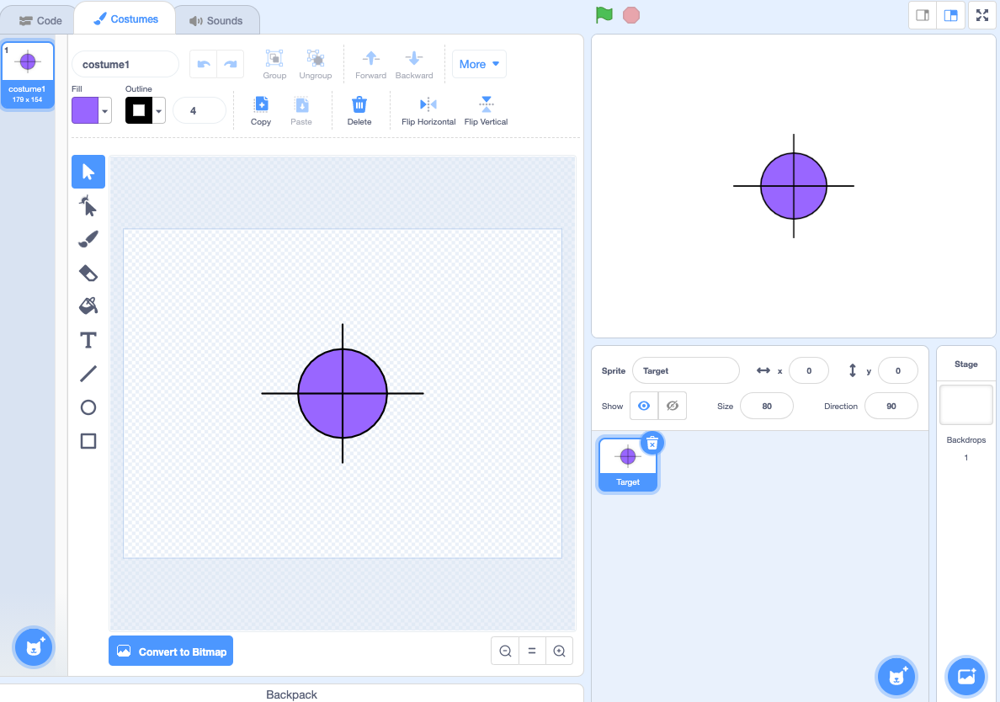
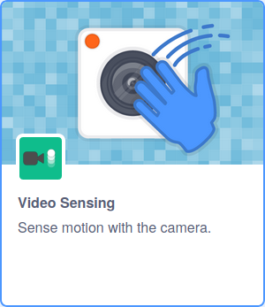

## Step title

In this step you will learn how to use the `video`{:class="block3extensions"} library to detect different colours on the screen.

--- task ---

If working **online**, open the [Scratch](http://scratch.mit.edu){:target="_blank"}.
 
If working **offline**, open a new project in the Scratch offline editor. If you need to download and install Scratch, you can find it [here](https://scratch.mit.edu/download){:target="_blank"}.

--- /task ---

--- task ---

Begin my deleting **Sprite1**. Then create a new sprite using the **Paint** tool.


--- /task ---

--- task ---

Use the **Circle** and **Line** tools, to create a target sprite at the centre of the canvas. You can fill the circle with any colour you like. Name the sprite **target**.



--- /task ---

--- task ---

Click on the **Code** tab for your new sprite, and then the **Add Extension** button in the bottom left hand corner of the screen.


Select the **Video sensing** library.



If asked, **Allow** access to your webcam.


--- /task ---

--- task ---

Add the following blocks to turn on the camera `set video transparency to 0`{:class="block3extensions"} and `set ghost effect to 80`{:class="block3looks"}, when `green flag clicked`{:class="block3events"}.


```blocks3
when flag clicked
set video transparency to [0]
turn video [on v]
set [ghost v] effect to [80]
```


--- /task ---

--- task ---

Add a `forever`{:class="block3control"} loop to the bottom of your script, and within this place an `if then`{:class="block3control"} block.


```blocks3
when flag clicked
set video transparency to [0]
turn video [on v]
set [ghost v] effect to [80]
+forever
+if <> then
```

--- /task ---

--- task ---

The `if then`{:class="block3control"} block will detect when a certain colour touches the **target** sprite. Add in a `touching color`{:class="block3sensing"} block to the script.


```blocks3
when flag clicked
set video transparency to [0]
turn video [on v]
set [ghost v] effect to [80]
forever
+if <touching color [] ?> then
```
--- /task ---

--- task ---

Click on the coloured oval within the `touching color`{:class="block3sensing"} block, and then select the **eye dropper** tool. 


Now hold up one of you coloured pieces of paper infront of the camera, and use the **eye dropper** tool to select the colour of the paper.


That colour should now be visible in the `touching color`{:class="block3sensing"} block.


```blocks3
when flag clicked
set video transparency to [0]
turn video [on v]
set [ghost v] effect to [80]
forever
+if <touching color [#FF9A94] ?> then
```

--- /task ---

--- task ---

Now add a `say for 2 seconds`{:class="block3looks"} adding in the text for the colour you selected.

```blocks3
when flag clicked
set video transparency to [0]
turn video [on v]
set [ghost v] effect to [80]
forever
+if <touching color [#FF6E66] ?> then
say [red] for [2] sec
```

--- /task ---

--- task ---

Now click the `green flag`{:class="block3control"} and hold up the paper and wave it over the target a few times, and it should say `red`{:class="block3looks"}.

--- print-only ---


--- /print-only ---

--- no-print ---


--- /no-print ---
--- /task ---


--- save ---
