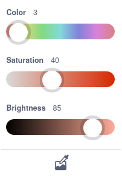
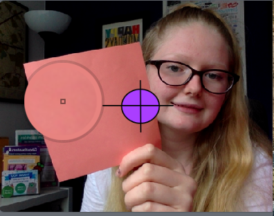

## Detect colours

In this step, you will learn how to use the `Video Sensing`{:class="block3extensions"} extension blocks to detect different colours on the screen. Get your three different-coloured plain pieces of paper or objects ready!

--- task ---

Open a new Scratch project.

**Online:** open a new online Scratch project at [scratch.mit.edu](https://scratch.mit.edu/projects/editor/){:target=”_blank”}.

**Offline:** open a new project in the Scratch offline editor. If you need to, you can [download and install Scratch here](https://scratch.mit.edu/download){:target=”_blank”}.

--- /task ---

--- task ---

First, delete the **Sprite1** sprite. Then, use the **Paint** tool to create a new sprite.


--- /task ---

--- task ---

Use the **Circle** and **Line** tools to create a target at the centre of the canvas. Make it small. You can fill the circle with any colour you like. Name the sprite `Target`.


--- /task ---

--- task ---

Click on the **Code** tab for your new **Target** sprite, and then click the **Add Extension** button in the bottom left-hand corner of the screen.

Select the **Video Sensing** extension.


--- print ---


--- /print ---

If asked, **Allow** access to your webcam.


--- /task ---

Now, you need to turn the video on to activate the computer's camera. The video is not shared over the internet. It is just used locally on your computer.

--- task ---

Add the following blocks: `when green flag clicked`{:class="block3events"}, `set video transparency to`{:class="block3extensions"} `0`, `turn video on`{:class="block3extensions"}, and `set ghost effect to`{:class="block3looks"} `80`:


```blocks3
when flag clicked
set video transparency to [0]
turn video [on v]
set [ghost v] effect to [80]
```
--- /task ---

--- task ---

Add a `forever`{:class="block3control"} loop to the bottom of your script, and within that loop, place an `if ... then`{:class="block3control"} block:


```blocks3
when flag clicked
set video transparency to [0]
turn video [on v]
set [ghost v] effect to [80]
+forever
+if <> then
```

--- /task ---

--- task ---

The `if ... then`{:class="block3control"} block will detect when a certain colour touches the **Target** sprite. Add a `touching color`{:class="block3sensing"} block into the script:


```blocks3
when flag clicked
set video transparency to [0]
turn video [on v]
set [ghost v] effect to [80]
forever
+if <touching color [] ?> then
```
--- /task ---

--- task ---

Click on the coloured oval within the `touching color`{:class="block3sensing"} block, and then select the **Colour picker** tool, which you will find below the three colour sliders. 



Now, hold up one of your coloured pieces of paper in front of the camera, and use the **Colour picker** tool to select the colour of the paper. In this example, we will use red paper, but you can use paper or objects of any colours you like.



That colour should now be visible in the `touching color`{:class="block3sensing"} block:


```blocks3
when flag clicked
set video transparency to [0]
turn video [on v]
set [ghost v] effect to [80]
forever
+if <touching color [#FF6E66] ?> then
```

--- /task ---

--- task ---

Add a `say for 2 seconds`{:class="block3looks"} block and write in `red` (or the colour that you selected):


```blocks3
when flag clicked
set video transparency to [0]
turn video [on v]
set [ghost v] effect to [80]
forever
+if <touching color [#FF6E66] ?> then
say [red] for [2] secs
```

--- /task ---

--- task ---

Click on the green flag. Hold up the paper or object and wave it over the target a few times, and it should say, "red" (or the colour that you selected).

--- print-only ---


--- /print-only ---

--- no-print ---


--- /no-print ---
--- /task ---

--- save ---
