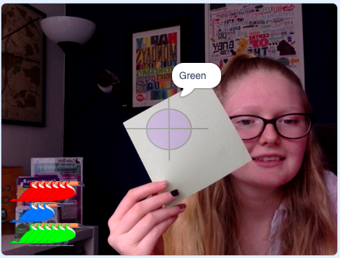

## More colours

Make the camera detect more colours!

--- task ---

Right-click on the `if ... then`{:class="block3control"} block and select **duplicate**, then add the new blocks into the `forever`{:class="block3control"} loop. Do this twice:


```blocks3
when flag clicked
set video transparency to [0]
turn video [on v]
set [ghost v] effect to [80]
forever
if <touching color [#FF6E66] ?> then
say [red] for [2] secs
end
+if <touching color [#FF6E66] ?> then
say [red] for [2] secs
end
+if <touching color [#FF6E66] ?> then
say [red] for [2] secs
end
```

--- /task ---

--- task ---

Just as you did before, use the **Colour picker** tool to change the colours of these new blocks, with paper or objects of different colours. Also, change the text in the `say`{:class="block3looks"} blocks:


```blocks3
when flag clicked
set video transparency to [0]
turn video [on v]
set [ghost v] effect to [80]
forever
if <touching color [#FF6E66] ?> then
say [red] for [2] secs
end
+if <touching color [#00D6FF] ?> then
say [blue] for [2] secs
end
+if <touching color [#62E09A] ?> then
say [green] for [2] secs
end
``` 

--- /task ---

--- task ---

Test your code: click on the green flag and hold up the pieces of paper or objects of different colours over the target.

--- no-print ---


--- /no-print ---

--- print-only ---



--- /print-only ---


--- /task ---

Depending on how the light in the room changes, the angle that you hold the paper or object at, and the quality of your webcam, you may find that sometimes the colour is not detected. To help with this, you can program the `touching color`{:class="block3sensing"} blocks to detect more than one colour.

--- task ---

Add an `or`{:class="block3operators"} block into the  `if ... then`{:class="block3control"} blocks, and add in the `touching color`{:class="block3sensing"} blocks:


```blocks3
when flag clicked
set video transparency to [0]
turn video [on v]
set [ghost v] effect to [80]
forever
+if < <touching color [#FF6E66] ?> or < > > then
say [red] for [2] secs
end
+if < <touching color [#00D6FF] ?> or < > >  then
say [blue] for [2] secs
end
+if < <touching color [#62E09A] ?> or < > > then
say [green] for [2] secs
end
``` 

--- /task ---

--- task ---

Add in three more `touching color`{:class="block3sensing"} blocks, and use the **Colour picker** tool to select a different area on the paper or object. 

**Note:** The colour recognition of your computer's camera will improve if you lighten the space that you are working in. The camera may also get confused by similar colours in the room, for example, the colour of your clothes, wall, or chair. 

The below code allows for a slight variation of colours of red, blue, and green:


```blocks3
when flag clicked
set video transparency to [0]
turn video [on v]
set [ghost v] effect to [80]
forever
+if <<touching color [#FF6E66] ?> or <touching color [#FF7E80] ?>> then
say [red] for [2] secs
end
+if <<touching color [#5DDCF5] ?> or <touching color [#00D6FF] ?>>  then
say [blue] for [2] secs
end
+if <<touching color [#62E09A] ?> or <touching color [#69E6A1] ?>> then
say [green] for [2] secs
end
``` 
--- /task ---

--- task ---

To test that your code works, click on the green flag and hold up the pieces of paper or objects in front of the camera.

--- /task ---

--- save ---
