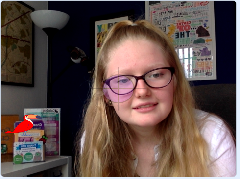

## Broadcasting colours

In this step you will use `broadcasts`{:class="block3events"} to send messages about colour from the **Target** sprite to the other sprites.

--- task ---

Import a new animal sprite into your project. You can choose any sprite you like, but in this example a **Toucan** will be used.

--- /task ---

--- task ---

Click on the **Costumes** tab and change the colour of the animal so that it matches one of the colours of your paper.


--- /task ---

--- task ---

Go back to your **Target** sprite. In the `Events`{:class="block3events"} menu you can drag a `broadcast [message1 v]`{:class="block3events"} block and then create a new message


Call the message `red` or whatever the first colour of your paper was.


--- /task ---

--- task ---

Add the new `broadcast`{:class="block3events"} block into your script, so it occurs when the camera sees the colour red:


```blocks3
when flag clicked
set video transparency to [0]
turn video [on v]
set [ghost v] effect to [80]
forever
if <<touching color [#FF6E66] ?> or <touching color [#FF7E80] ?>> then
+ broadcast [red v]
say [red] for [2] secs
end
if <<touching color [#00D6FF] ?> or <touching color [#00D6FF] ?>>  then
say [blue] for [2] secs
end
if <<touching color [#62E09A] ?> or <touching color [#69E6A1] ?>> then
say [green] for [2] secs
end
``` 

--- /task ---

--- task ---

Repeat this for the other colours:


```blocks3
when flag clicked
set video transparency to [0]
turn video [on v]
set [ghost v] effect to [80]
forever
if <<touching color [#FF6E66] ?> or <touching color [#FF7E80] ?>> then
broadcast [red v]
say [red] for [2] secs
end
if <<touching color [#00D6FF] ?> or <touching color [#00D6FF] ?>>  then
+ broadcast [blue v]
say [blue] for [2] secs
end
if <<touching color [#62E09A] ?> or <touching color [#69E6A1] ?>> then
+ broadcast [green v]
say [green] for [2] secs
end
```
--- /task ---

--- task ---

Click back to your animal sprite. Position and size your animal so if fits nicely on the left hand side of the **Stage**, below the **Target** sprite.



--- /task ---

--- task ---

Add code so that the sprite moves across the screen, each time it receives the `red`{:class="block3events"} broadcast:


```blocks3
when I receive [red v]
change x by [10]
```

--- /task ---

--- task ---

Hold up your paper so it touches the target. Test that the sprite moves across the screen when the colour is recognised.

--- /task ---

--- save ---


