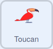

## Counting colours

In this step you will count the number of red birds that pass the target sprite, and represent this number on the stage.

--- task ---

Select your animal sprite, and then in the code tab, add the `Pen`{:class="block3extensions"} extension.

--- /task ---

--- task ---

Each time the sprite moves, it can `stamp`{:class="block3extensions"} an image of itself on the stage.



```blocks3
when I receive [red v]
stamp
change x by [10]
```
--- /task ---

--- task ---

Click the green flag and then hold your coloured paper up to the camera. You should see the animal move across the screen, and leave behind a stamped image of itself.

--- /task ---

At the moment, as the sprite is visible, you are counting one to many animals. You can solve this by hiding the sprite.

--- task ---

Add the following code, to hide and show the sprite as it moves.


```blocks3
when I receive [red v]
+show
stamp
change x by [10]
+hide
```

--- /task ---

--- task ---

Click the green flag and test out the motion and stamping of the sprite why you hold up the coloured paper to the camera.

--- /task ---

To finish off, the stage needs resetting each time the green flag is clicked.


--- task ---

Add the following script to the animal sprite, to reset the animal's position and clear the screen of the stamps.


```blocks3
when flag clicked
hide
erase all
go to x: [-200] y: [-90]
```

--- /task ---

--- task ---

Click the green flag again and the screen should clear. Hold up the coloured paper to advance and stamp the sprite.

--- /task ---

--- save ---
