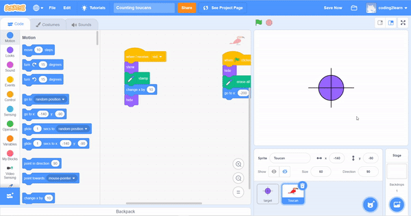
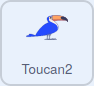
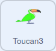

## More animals

In this step you will add more coloured animals to count.

--- task ---

Right click on your animal sprite, **duplicate** it, and then use the **Costumes** tab to re-colour the sprite.

--- print-only ---



--- /print-only ---

--- /task ---

--- task ---

Repeat this process so that you have three animal sprites that match the colours of your paper. The code will also be duplicated for each sprite.

--- /task ---

--- task ---

Now you need to edit the code, so that each of the sprites has a unique starting position.




```blocks3
when flag clicked
hide
erase all
go to x: [-200] y: [-120]
```



```blocks3
when flag clicked
hide
erase all
go to x: [-200] y: [-120]
```
--- /task ---

If you were to test your script at the moment, then a single colour would cause all the sprites to move and stamp. You need to use the different colour broadcasts in your code.

--- task ---

Change the broadcast trigger for each of the new sprites.


```blocks3
+when I receive [blue v]
show
stamp
change x by [10]
hide
```


```blocks3
+when I receive [green v]
show
stamp
change x by [10]
hide
```

--- /task ---

--- task ---

Test your code by holding up the paper in front of the camera, and making sure that the sprites advance and stamp each time.

--- /task ---

--- save ---
